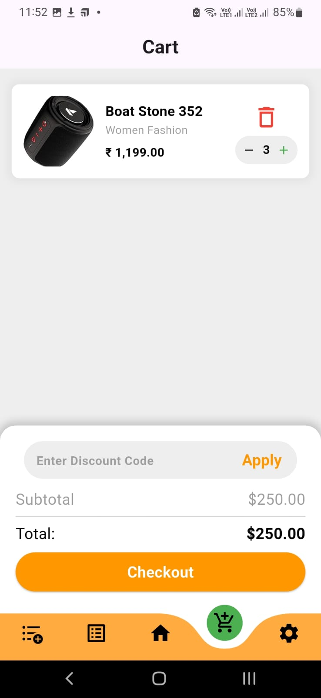
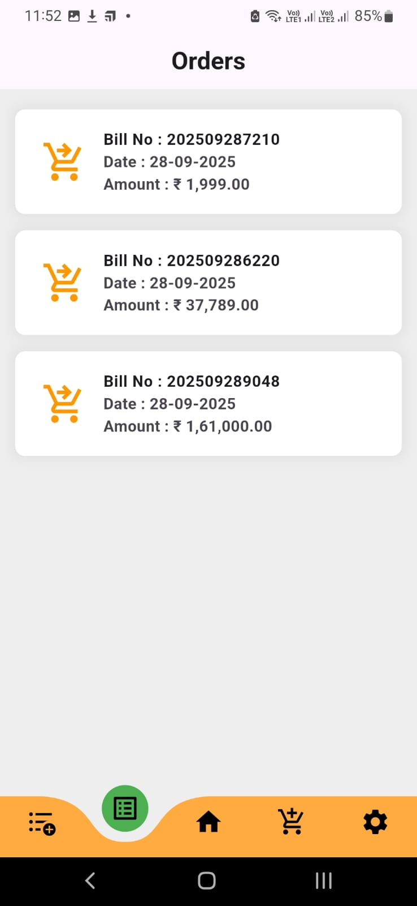
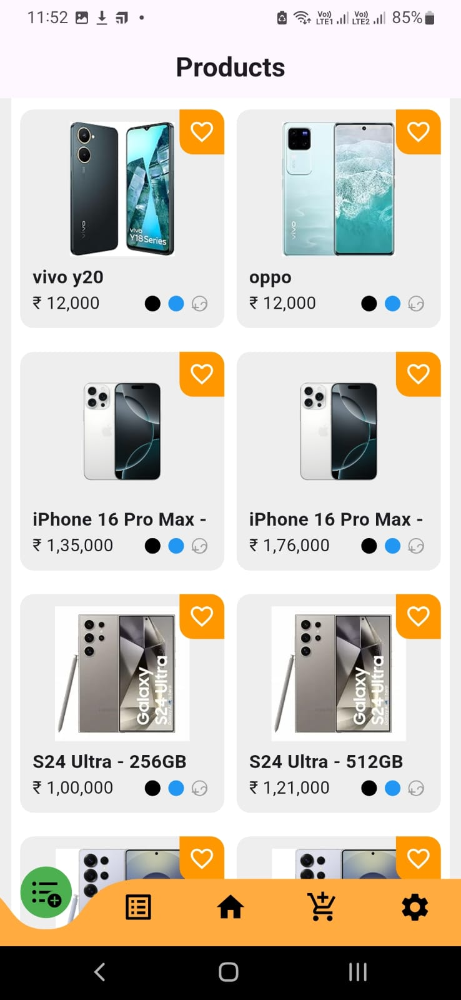
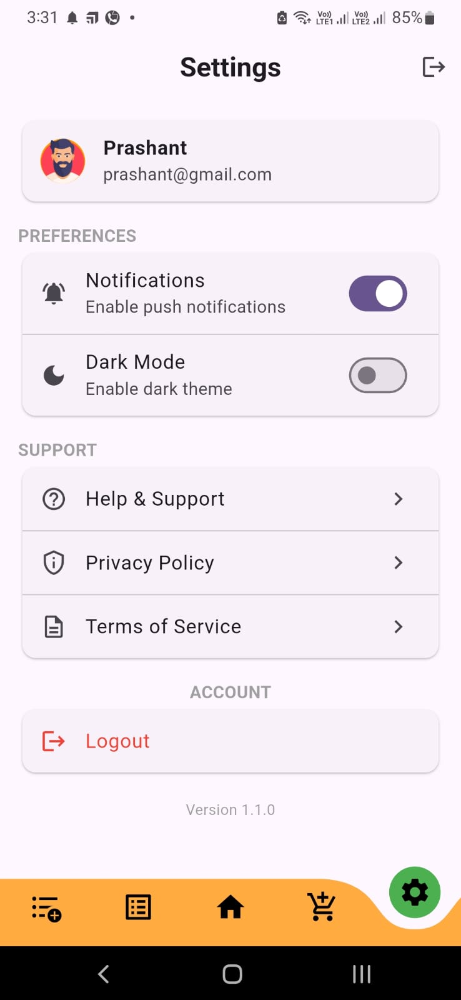
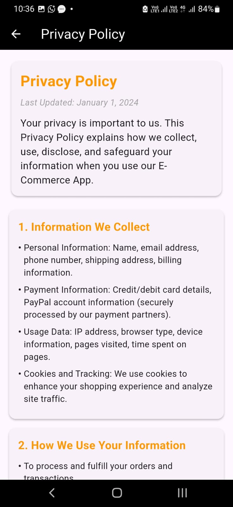
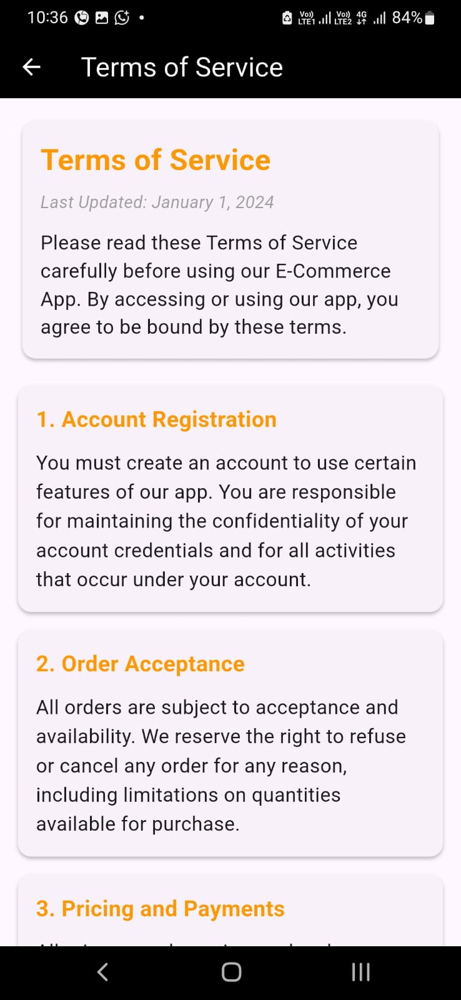
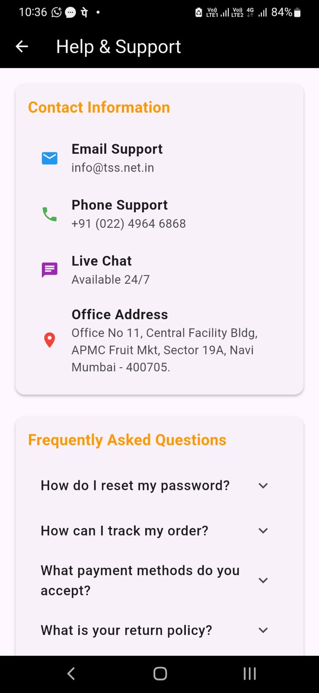

# flutter-ecom-api

## packages

flutter pub add flutter_bloc http intl shared_preferences carousel_slider dots_indicator curved_navigation_bar awesome_dialog

| Task                         | Status |
| ---------------------------- | ------ |
| Indicator Package Implement  | Yes    |
| Fetch Category Data          | Yes    |
| Fetch Product Categorywise   | Yes    |
| Display all Products         | Yes    |
| Calculate subtotal and total | Yes    |
| Inc/ Dec qty for cart item   | Yes    |
| delete cart                  | Yes    |
| Coupon Code                  | Yes    |
| Product Order                | Yes    |
| Order Page                   | Yes    |

## Features

1. [x] Form Validation
1. [x] MVV Archtecture
1. [x] No warning, errors, no print()
1. [x] Awesoem Dialogs
1. [x] Curved Animation
1. [x] Display data of logged in user only.

## UI

1. [x] Splash : Splash page for display company branding.
1. [x] Login : Login user to application.
1. [x] Sign Up : Create User.
1. [x] Home Page : Display product listing by category.
1. [x] Product Page : Display product details and can add to cart.
1. [x] Cart Page : Display product added to cart and can increment, decrement qty.
1. [x] Order Page : Display Previously completed orders.
1. [x] Settings : User Profile, logout.
1. [x] Help & Support : Company Help line contact details, FAQ, Office Hours.
1. [x] Privacy Policy : User data privacy policy.
1. [x] Terms of Service : Terms and conditions for services offered by application.
1. [x] Discount Coupon : Both disocunt coupon working.

## Images

|                                                  |                                                 |                                                |
| ------------------------------------------------ | ----------------------------------------------- | ---------------------------------------------- |
| Splash                                           | Login                                           | Signup                                         |
|     |     |   |
| Home                                             | Cart Item                                       | Orders                                         |
|      |     |  |
| All Products                                     | Settings                                        | Privacy Policy                                 |
|  |  |  |
| Terms & Condition                                | Support                                         |                                                |
|     |  |                                                |

## MVV folder structure

```
lib/
├── core/ # Reusable, app-wide code
| ├── constants/
| | ├─── app_colors.dart → all custom colors
| | ├─── app_strings.dart → text constants (labels, error messages, etc.)
| | ├─── app_sizes.dart → spacing, padding, radius, etc.
| | ├─── app_icons.dart → asset paths for icons/images
| | └─── api_constants.dart → base urls, endpoints, keys
│ ├── error/
│ ├── network/ → external communication (API)
| ├── routes/ → internal communication (navigation)
│ ├── usecases/
│ └── utils/
├── features/ # Each feature is isolated
│ ├── authentication/
│ │ ├── data/ # Data layer (Repositories, API, DB)
│ │ │ ├── datasources/
│ │ │ ├── models/
│ │ │ └── repositories_impl/
│ │ ├── domain/ # Business rules
│ │ │ ├── entities/
│ │ │ ├── repositories/
│ │ │ └── usecases/
│ │ └── presentation/ # UI layer
│ │ ├── bloc/ # or cubit/provider/riverpod
│ │ ├── pages/
│ │ └── widgets/
│ │
│ └── home/
│ ├── data/
│ ├── domain/
│ └── presentation/
│
├── injection_container.dart # Dependency Injection setup
├── main.dart # Entry point
└── app.dart # App root widget, routes, theme
│
assets/
├── images/ # PNG, JPG, SVGs
└── fonts/ # Custom fonts
```

## Create folder structure with cli on linux

```
mkdir -p lib/{core/{error,network,routes, usecases,utils},features/{template/{data/{datasources,models},domain/{entities,repositories,usecases},presentation/{bloc,pages,widgets}},template/{data,domain,presentation}}} && touch lib/{injection_container.dart,main.dart,app.dart} && mkdir -p assets/{images,fonts}
```
