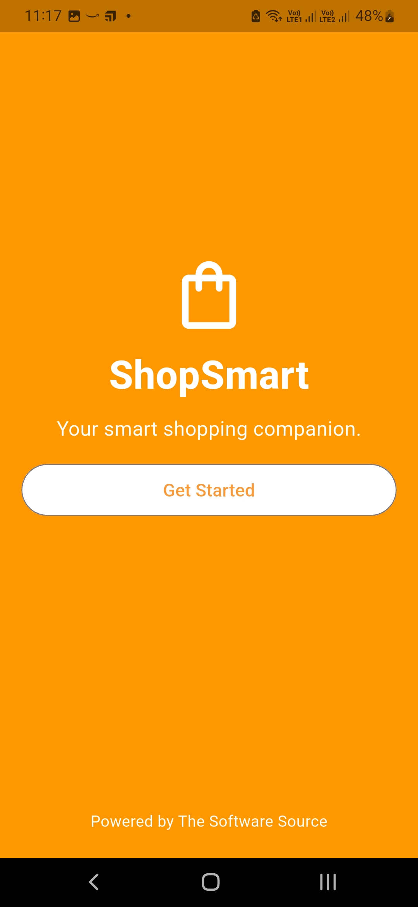
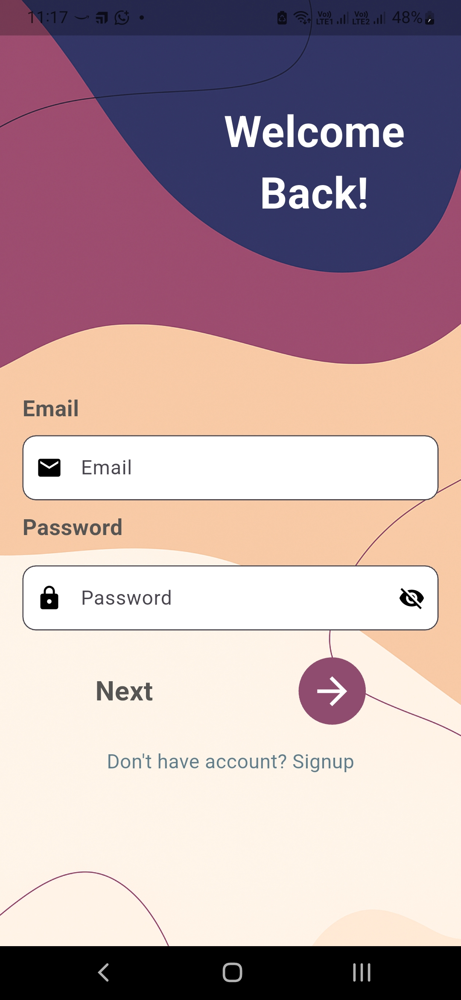
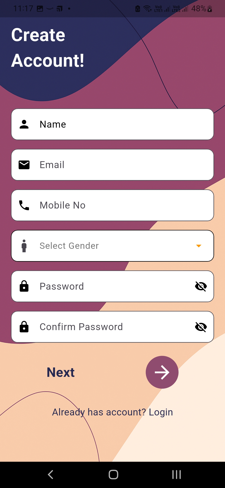

# flutter-ecom-api

## packages

flutter pub add flutter_bloc http intl shared_preferences

```
mkdir -p lib/{core/{error,network,routes, usecases,utils},features/{authentication/{data/{datasources,models,repositories_impl},domain/{entities,repositories,usecases},presentation/{bloc,pages,widgets}},home/{data,domain,presentation}}} && touch lib/{injection_container.dart,main.dart,app.dart} && mkdir -p assets/{images,fonts}
```

lib/
├── core/ # Reusable, app-wide code
| ├── constants/
| | ├─── app_colors.dart → all custom colors
| | ├─── app_strings.dart → text constants (labels, error messages, etc.)
| | ├─── app_sizes.dart → spacing, padding, radius, etc.
| | ├─── app_icons.dart → asset paths for icons/images
| | └─── api_constants.dart → base urls, endpoints, keys
│ ├── error/
│ ├── network/ → external communication (API)
| ├── routes/ → internal communication (navigation)
│ ├── usecases/
│ └── utils/
├── features/ # Each feature is isolated
│ ├── authentication/
│ │ ├── data/ # Data layer (Repositories, API, DB)
│ │ │ ├── datasources/
│ │ │ ├── models/
│ │ │ └── repositories_impl/
│ │ ├── domain/ # Business rules
│ │ │ ├── entities/
│ │ │ ├── repositories/
│ │ │ └── usecases/
│ │ └── presentation/ # UI layer
│ │ ├── bloc/ # or cubit/provider/riverpod
│ │ ├── pages/
│ │ └── widgets/
│ │
│ └── home/
│ ├── data/
│ ├── domain/
│ └── presentation/
│
├── injection_container.dart # Dependency Injection setup
├── main.dart # Entry point
└── app.dart # App root widget, routes, theme
│
assets/
├── images/ # PNG, JPG, SVGs
└── fonts/ # Custom fonts

[X] Images Path
[X] Font Path
[] Splash Screen
[] Authentication

## Features

1. [x] Form Validation
1. [x] MVV Archtecture
1. [x] No warning & Errors
1. [ ] Animation
1. [ ] Theme

## UI

1. [x] Splash : Splash page for display company branding.
1. [x] Login : Login user to application.
1. [x] Sign Up : Create User.
1. [x] Home Page : Display product listing by category.
1. [x] Product Page : Display product details and can add to cart.
1. [x] Cart Page : Display product added to cart and can increment, decrement qty.
1. [x] Order Page : Display Previously completed orders.
1. [x] Settings : User Profile, logout.
1. [ ] Discount Coupon :

## Images

|                                               |                                              |                                               |
| --------------------------------------------- | -------------------------------------------- | --------------------------------------------- |
| Splash                                        | Login                                        | Signup                                        |
|  |  |  |
| Home                                          | Cart Item                                    | Orders                                        |
| All Products                                  | Settings                                     | Privacy                                       |
| Terms & Condition                             | Support                                      |                                               |
